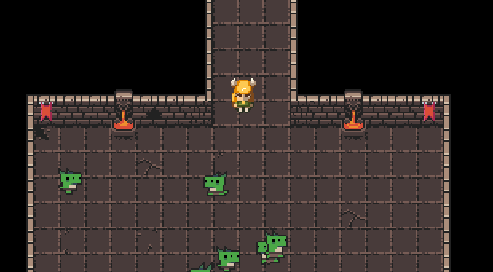

<p align="center">
  
</p>

# Dungeon Crawler - Phaser 3

A dungeon crawler base game, inspired on [Ourcade Tutorial](https://www.youtube.com/playlist?list=PLumYWZ2t7CRtgjbZK0JMoXHjebeYmT85-), made on [Phaser 3 Framework](https://phaser.io/phaser3), using [Typescript](https://www.typescriptlang.org/) and compiled with [Parcel v2](https://v2.parceljs.org/).

## Setup

### Prerequisites

Install [Node.js](https://nodejs.org/en) and [Yarn](https://classic.yarnpkg.com/en/docs/install).

### Installing

```bash
git clone https://github.com/acquati/dungeon-crawler-phaser-3.git
cd dungeon-crawler-phaser-3
yarn install

# Development
yarn run dev

# Build
yarn run build

# Start server
yarn run start

# Lint
yarn run lint
```

Access [localhost:8080](http://localhost:8080/) in your browser.

## Troubleshoot

### Update NPM & YARN global command on Ubuntu

```bash
sudo apt update
sudo apt upgrade
sudo apt autoremove

sudo npm install npm -g

sudo npm cache clean -f
sudo npm install -g n
sudo n stable

sudo npm install --global yarn
```
